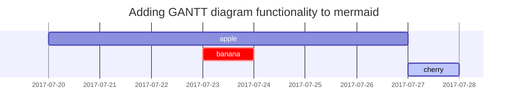

# Markdown: Syntax

*   [Overview](#overview)
    *   [Philosophy](#philosophy)
    *   [Inline HTML](#html)
    *   [Automatic Escaping for Special Characters](#autoescape)
*   [Block Elements](#block)
    *   [Paragraphs and Line Breaks](#p)
    *   [Headers](#header)
    *   [Blockquotes](#blockquote)
    *   [Lists](#list)
    *   [Code Blocks](#precode)
    *   [Horizontal Rules](#hr)
*   [Span Elements](#span)
    *   [Links](#link)
    *   [Emphasis](#em)
    *   [Code](#code)
    *   [Images](#img)
*   [Miscellaneous](#misc)
    *   [Backslash Escapes](#backslash)
    *   [Automatic Links](#autolink)


**Note:** This document is itself written using Markdown; you
can [see the source for it by adding '.text' to the URL](/projects/markdown/syntax.text).

----

## Overview

### Philosophy

Markdown is intended to be as easy-to-read and easy-to-write as is feasible.

Readability, however, is emphasized above all else. A Markdown-formatted
document should be publishable as-is, as plain text, without looking
like it's been marked up with tags or formatting instructions. While
Markdown's syntax has been influenced by several existing text-to-HTML
filters -- including [Setext](http://docutils.sourceforge.net/mirror/setext.html), [atx](http://www.aaronsw.com/2002/atx/), [Textile](http://textism.com/tools/textile/), [reStructuredText](http://docutils.sourceforge.net/rst.html),
[Grutatext](http://www.triptico.com/software/grutatxt.html), and [EtText](http://ettext.taint.org/doc/) -- the single biggest source of
inspiration for Markdown's syntax is the format of plain text email.

## Block Elements

### Paragraphs and Line Breaks

A paragraph is simply one or more consecutive lines of text, separated
by one or more blank lines. (A blank line is any line that looks like a
blank line -- a line containing nothing but spaces or tabs is considered
blank.) Normal paragraphs should not be indented with spaces or tabs.

The implication of the "one or more consecutive lines of text" rule is
that Markdown supports "hard-wrapped" text paragraphs. This differs
significantly from most other text-to-HTML formatters (including Movable
Type's "Convert Line Breaks" option) which translate every line break
character in a paragraph into a `<br />` tag.

When you *do* want to insert a `<br />` break tag using Markdown, you
end a line with two or more spaces, then type return.

### Headers

Markdown supports two styles of headers, [Setext] [1] and [atx] [2].

Optionally, you may "close" atx-style headers. This is purely
cosmetic -- you can use this if you think it looks better. The
closing hashes don't even need to match the number of hashes
used to open the header. (The number of opening hashes
determines the header level.)


### Blockquotes

Markdown uses email-style `>` characters for blockquoting. If you're
familiar with quoting passages of text in an email message, then you
know how to create a blockquote in Markdown. It looks best if you hard
wrap the text and put a `>` before every line:

> This is a blockquote with two paragraphs. Lorem ipsum dolor sit amet,
> consectetuer adipiscing elit. Aliquam hendrerit mi posuere lectus.
> Vestibulum enim wisi, viverra nec, fringilla in, laoreet vitae, risus.
> 
> Donec sit amet nisl. Aliquam semper ipsum sit amet velit. Suspendisse
> id sem consectetuer libero luctus adipiscing.

Markdown allows you to be lazy and only put the `>` before the first
line of a hard-wrapped paragraph:

> This is a blockquote with two paragraphs. Lorem ipsum dolor sit amet,
consectetuer adipiscing elit. Aliquam hendrerit mi posuere lectus.
Vestibulum enim wisi, viverra nec, fringilla in, laoreet vitae, risus.

> Donec sit amet nisl. Aliquam semper ipsum sit amet velit. Suspendisse
id sem consectetuer libero luctus adipiscing.

Blockquotes can be nested (i.e. a blockquote-in-a-blockquote) by
adding additional levels of `>`:

> This is the first level of quoting.
>
> > This is nested blockquote.
>
> Back to the first level.

Blockquotes can contain other Markdown elements, including headers, lists,
and code blocks:

> ## This is a header.
> 
> 1.   This is the first list item.
> 2.   This is the second list item.
> 
> Here's some example code:
> 
>     return shell_exec("echo $input | $markdown_script");

Any decent text editor should make email-style quoting easy. For
example, with BBEdit, you can make a selection and choose Increase
Quote Level from the Text menu.


### Lists

Markdown supports ordered (numbered) and unordered (bulleted) lists.

Unordered lists use asterisks, pluses, and hyphens -- interchangably
-- as list markers:

*   Red
*   Green
*   Blue

is equivalent to:

+   Red
+   Green
+   Blue

and:

-   Red
-   Green
-   Blue

Ordered lists use numbers followed by periods:

1.  Bird
2.  McHale
3.  Parish

It's important to note that the actual numbers you use to mark the
list have no effect on the HTML output Markdown produces. The HTML
Markdown produces from the above list is:

If you instead wrote the list in Markdown like this:

1.  Bird
1.  McHale
1.  Parish

or even:

3. Bird
1. McHale
8. Parish

you'd get the exact same HTML output. The point is, if you want to,
you can use ordinal numbers in your ordered Markdown lists, so that
the numbers in your source match the numbers in your published HTML.
But if you want to be lazy, you don't have to.

To make lists look nice, you can wrap items with hanging indents:

*   Lorem ipsum dolor sit amet, consectetuer adipiscing elit.
    Aliquam hendrerit mi posuere lectus. Vestibulum enim wisi,
    viverra nec, fringilla in, laoreet vitae, risus.
*   Donec sit amet nisl. Aliquam semper ipsum sit amet velit.
    Suspendisse id sem consectetuer libero luctus adipiscing.

But if you want to be lazy, you don't have to:

*   Lorem ipsum dolor sit amet, consectetuer adipiscing elit.
Aliquam hendrerit mi posuere lectus. Vestibulum enim wisi,
viverra nec, fringilla in, laoreet vitae, risus.
*   Donec sit amet nisl. Aliquam semper ipsum sit amet velit.
Suspendisse id sem consectetuer libero luctus adipiscing.

List items may consist of multiple paragraphs. Each subsequent
paragraph in a list item must be indented by either 4 spaces
or one tab:

1.  This is a list item with two paragraphs. Lorem ipsum dolor
    sit amet, consectetuer adipiscing elit. Aliquam hendrerit
    mi posuere lectus.

    Vestibulum enim wisi, viverra nec, fringilla in, laoreet
    vitae, risus. Donec sit amet nisl. Aliquam semper ipsum
    sit amet velit.

2.  Suspendisse id sem consectetuer libero luctus adipiscing.

It looks nice if you indent every line of the subsequent
paragraphs, but here again, Markdown will allow you to be
lazy:

*   This is a list item with two paragraphs.

    This is the second paragraph in the list item. You're
only required to indent the first line. Lorem ipsum dolor
sit amet, consectetuer adipiscing elit.

*   Another item in the same list.

To put a blockquote within a list item, the blockquote's `>`
delimiters need to be indented:

*   A list item with a blockquote:

    > This is a blockquote
    > inside a list item.

To put a code block within a list item, the code block needs
to be indented *twice* -- 8 spaces or two tabs:

*   A list item with a code block:

        <code goes here>

### Code Blocks

Pre-formatted code blocks are used for writing about programming or
markup source code. Rather than forming normal paragraphs, the lines
of a code block are interpreted literally. Markdown wraps a code block
in both `<pre>` and `<code>` tags.

To produce a code block in Markdown, simply indent every line of the
block by at least 4 spaces or 1 tab.

This is a normal paragraph:

    This is a code block.

Here is an example of AppleScript:

    tell application "Foo"
        beep
    end tell

A code block continues until it reaches a line that is not indented
(or the end of the article).

Within a code block, ampersands (`&`) and angle brackets (`<` and `>`)
are automatically converted into HTML entities. This makes it very
easy to include example HTML source code using Markdown -- just paste
it and indent it, and Markdown will handle the hassle of encoding the
ampersands and angle brackets. For example, this:

    <div class="footer">
        &copy; 2004 Foo Corporation
    </div>

Regular Markdown syntax is not processed within code blocks. E.g.,
asterisks are just literal asterisks within a code block. This means
it's also easy to use Markdown to write about Markdown's own syntax.

```
tell application "Foo"
    beep
end tell
```

## Span Elements

### Links

Markdown supports two style of links: *inline* and *reference*.

In both styles, the link text is delimited by [square brackets].

To create an inline link, use a set of regular parentheses immediately
after the link text's closing square bracket. Inside the parentheses,
put the URL where you want the link to point, along with an *optional*
title for the link, surrounded in quotes. For example:

This is [an example](http://example.com/) inline link.

[This link](http://example.net/) has no title attribute.

### Emphasis

Markdown treats asterisks (`*`) and underscores (`_`) as indicators of
emphasis. Text wrapped with one `*` or `_` will be wrapped with an
HTML `<em>` tag; double `*`'s or `_`'s will be wrapped with an HTML
`<strong>` tag. E.g., this input:

*single asterisks*

_single underscores_

**double asterisks**

__double underscores__

### Code

To indicate a span of code, wrap it with backtick quotes (`` ` ``).
Unlike a pre-formatted code block, a code span indicates code within a
normal paragraph. For example:

Use the `printf()` function.

---


---


---


## Headings

<!-- markdownlint-capture -->
<!-- markdownlint-disable -->
# H1 — heading
{: .mt-4 .mb-0 }

## H2 — heading
{: data-toc-skip='' .mt-4 .mb-0 }

### H3 — heading
{: data-toc-skip='' .mt-4 .mb-0 }

#### H4 — heading
{: data-toc-skip='' .mt-4 }
<!-- markdownlint-restore -->

## Paragraph

Quisque egestas convallis ipsum, ut sollicitudin risus tincidunt a. Maecenas interdum malesuada egestas. Duis consectetur porta risus, sit amet vulputate urna facilisis ac. Phasellus semper dui non purus ultrices sodales. Aliquam ante lorem, ornare a feugiat ac, finibus nec mauris. Vivamus ut tristique nisi. Sed vel leo vulputate, efficitur risus non, posuere mi. Nullam tincidunt bibendum rutrum. Proin commodo ornare sapien. Vivamus interdum diam sed sapien blandit, sit amet aliquam risus mattis. Nullam arcu turpis, mollis quis laoreet at, placerat id nibh. Suspendisse venenatis eros eros.

## Lists

### Ordered list

1. Firstly
2. Secondly
3. Thirdly

### Unordered list

- Chapter
  - Section
    - Paragraph

### ToDo list

- [ ] Job
  - [x] Step 1
  - [x] Step 2
  - [ ] Step 3

### Description list

Sun
: the star around which the earth orbits

Moon
: the natural satellite of the earth, visible by reflected light from the sun

## Block Quote

> This line shows the _block quote_.

## Prompts

<!-- markdownlint-capture -->
<!-- markdownlint-disable -->
> An example showing the `tip` type prompt.
{: .prompt-tip }

> An example showing the `info` type prompt.
{: .prompt-info }

> An example showing the `warning` type prompt.
{: .prompt-warning }

> An example showing the `danger` type prompt.
{: .prompt-danger }
<!-- markdownlint-restore -->

## Tables

| Company                      | Contact          | Country |
| :--------------------------- | :--------------- | ------: |
| Alfreds Futterkiste          | Maria Anders     | Germany |
| Island Trading               | Helen Bennett    |      UK |
| Magazzini Alimentari Riuniti | Giovanni Rovelli |   Italy |

## Links

<http://127.0.0.1:4000>

## Footnote

Click the hook will locate the footnote[^footnote], and here is another footnote[^fn-nth-2].

## Inline code

This is an example of `Inline Code`.

## Filepath

Here is the `/path/to/the/file.extend`{: .filepath}.

## Code blocks

### Common

```text
This is a common code snippet, without syntax highlight and line number.
```

### Specific Language

```bash
if [ $? -ne 0 ]; then
  echo "The command was not successful.";
  #do the needful / exit
fi;
```

### Specific filename

```sass
@import
  "colors/light-typography",
  "colors/dark-typography";
```
{: file='_sass/jekyll-theme-chirpy.scss'}

## Mathematics

The mathematics powered by [**MathJax**](https://www.mathjax.org/):

$$
\begin{equation}
  \sum_{n=1}^\infty 1/n^2 = \frac{\pi^2}{6}
  \label{eq:series}
\end{equation}
$$

We can reference the equation as \eqref{eq:series}.

When $a \ne 0$, there are two solutions to $ax^2 + bx + c = 0$ and they are

$$ x = {-b \pm \sqrt{b^2-4ac} \over 2a} $$

## Mermaid SVG



## Images

### Default (with caption)

{: width="972" height="589" }
_Full screen width and center alignment_

### Left aligned

{: width="972" height="589" .w-75 .normal}

### Float to left

{: width="972" height="589" .w-50 .left}
Praesent maximus aliquam sapien. Sed vel neque in dolor pulvinar auctor. Maecenas pharetra, sem sit amet interdum posuere, tellus lacus eleifend magna, ac lobortis felis ipsum id sapien. Proin ornare rutrum metus, ac convallis diam volutpat sit amet. Phasellus volutpat, elit sit amet tincidunt mollis, felis mi scelerisque mauris, ut facilisis leo magna accumsan sapien. In rutrum vehicula nisl eget tempor. Nullam maximus ullamcorper libero non maximus. Integer ultricies velit id convallis varius. Praesent eu nisl eu urna finibus ultrices id nec ex. Mauris ac mattis quam. Fusce aliquam est nec sapien bibendum, vitae malesuada ligula condimentum.

### Float to right

{: width="972" height="589" .w-50 .right}
Praesent maximus aliquam sapien. Sed vel neque in dolor pulvinar auctor. Maecenas pharetra, sem sit amet interdum posuere, tellus lacus eleifend magna, ac lobortis felis ipsum id sapien. Proin ornare rutrum metus, ac convallis diam volutpat sit amet. Phasellus volutpat, elit sit amet tincidunt mollis, felis mi scelerisque mauris, ut facilisis leo magna accumsan sapien. In rutrum vehicula nisl eget tempor. Nullam maximus ullamcorper libero non maximus. Integer ultricies velit id convallis varius. Praesent eu nisl eu urna finibus ultrices id nec ex. Mauris ac mattis quam. Fusce aliquam est nec sapien bibendum, vitae malesuada ligula condimentum.

### Dark/Light mode & Shadow

The image below will toggle dark/light mode based on theme preference, notice it has shadows.

{: .light .w-75 .shadow .rounded-10 w='1212' h='668' }
{: .dark .w-75 .shadow .rounded-10 w='1212' h='668' }

## Video



## Reverse Footnote

[^footnote]: The footnote source
[^fn-nth-2]: The 2nd footnote source
